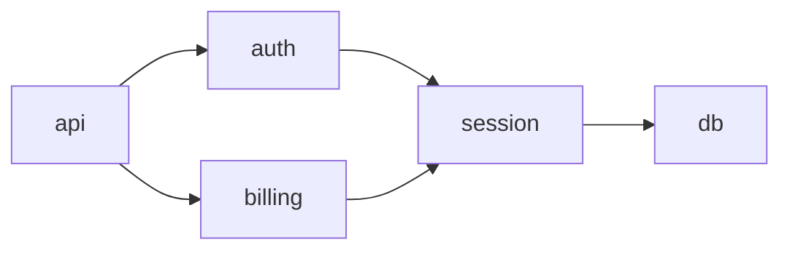

# Conducty Context — Project Ingestion as a Sub-Graph

A single big `Context My App.md` is a brittle context engine. Re-reading 250 lines on every plan misses what changed and what's stale. Instead, **conducty-context** decomposes a project into a linked sub-graph in the Obsidian vault. Each note has one purpose, a stable filename, and explicit cross-links. Plans pull only the slices they need; refreshes record deltas instead of overwriting.

> [!important] Read [[conducty-obsidian]] first
> All output goes to the vault. Per-instance notes follow Title Case; this skill writes a hub note plus several sub-notes per project.

## When to Use

- First time loading a project: `conducty-context /path/to/project`
- The user says "refresh context" or "the project has changed since last load"
- Plan execution surfaces stale architecture info — a refresh fires
- A new bounded context emerges that wasn't captured before

## The Project Sub-Graph

For each project, the vault holds one **hub** note plus a set of **slice** notes. All slice names are deterministic so wikilinks resolve from any plan or design.

| Slice | Filename | Holds |
|-------|----------|-------|
| Hub | `Context {Project}.md` | One-paragraph project identity, links to every slice, last-refreshed timestamp |
| Architecture | `Context {Project} Architecture.md` | Bounded contexts, modules, dependency map (Mermaid), seams |
| Conventions | `Context {Project} Conventions.md` | Coding style, naming, file organization, lint/format commands |
| Invariants | `Context {Project} Invariants.md` | Public API surfaces, schemas, contracts, anything that MUST NOT change without intent |
| Hotspots | `Context {Project} Hotspots.md` | Frequently changed files, recent activity, churn risks |
| Tests | `Context {Project} Tests.md` | Test command, typecheck command, vuln-check command, coverage data, characterization data |
| Glossary | `Context {Project} Glossary.md` | Domain terms, ubiquitous language, acronyms |

**Bounded-context deep notes** (optional, written when a module is large enough to warrant one):

- `Context {Project} {Module}.md` — purpose, public interface, internal invariants, key files

**Refresh deltas** (one per refresh):

- `Context Refresh {Project} YYYY-MM-DD HHmm.md` — what changed since last load: new files, removed files, new bounded contexts, broken invariants, new convention violations. Older refresh notes accumulate as a temporal record.

## Workflow

### Step 1: Identify the Target

Resolve the directory path to absolute. Extract project name from the basename, convert to Title Case for vault filenames (`my-app` → `My App`).

Check the vault for an existing hub note:

```bash
test -f "$VAULT/Context/$PROJECT/Context $PROJECT.md" && echo "refresh" || echo "first load"
```

If this is a first load, create the project sub-graph directories before writing any slice:

```bash
mkdir -p "$VAULT/Context/$PROJECT/Modules" "$VAULT/Context/$PROJECT/Refreshes"
```

### Step 2: First Load vs. Refresh

**First load:** generate every slice + the hub. Move on.

**Refresh:** read the existing hub's `last_refreshed` frontmatter. Compute deltas (Step 7) and either edit each slice in place (preserving frontmatter, prepending changes) or write a refresh-delta note describing the diff and updating the hub's `last_refreshed`.

### Step 3: Read Project Identity

Read these files if present (skip if absent):

- `README.md` or `README`
- `package.json`, `Cargo.toml`, `pyproject.toml`, `go.mod`, `Gemfile`, `pom.xml`
- `docker-compose.yml`, `Dockerfile`
- `AGENTS.md`, `CLAUDE.md` — agent instructions
- `.editorconfig`, `tsconfig.json`, `.eslintrc*`, `prettier*`, `ruff.toml`, `.golangci.yml` — style/lint
- `.claude/` if present — local skills/commands

Capture: language, framework, key dependencies, build/test/lint commands, declared style rules, any agent instructions.

### Step 4: Map Architecture and Bounded Contexts

Use Glob (`src/**`, `lib/**`, `pkg/**`, `app/**`) two levels deep to enumerate modules. For each module:

- What is its responsibility?
- What does it import from other modules?
- What imports it?
- What's its public surface (exports)?

**Render a Mermaid dependency diagram** in the Architecture slice — Obsidian renders Mermaid natively:



For modules with non-trivial internal complexity (>500 lines, multiple sub-responsibilities, or a public API surface other code depends on), generate a **bounded-context deep note** at `Context/{Project}/Modules/Context {Project} {Module}.md` and link it from Architecture.

### Step 5: Capture Conventions

From style configs and observed code:

- Naming: file, type, function, variable
- File organization: where do new features go? where do tests live?
- Patterns: error handling, logging, configuration, dependency injection
- Forbidden: things the project explicitly rejects (commented in CLAUDE.md, lint rules, README)
- Lint/format commands

### Step 6: Capture Invariants

Things that MUST NOT change silently:

- Public API surfaces (HTTP routes, exported functions, RPC schemas)
- Database schemas / migrations
- Configuration contracts (env vars, config files)
- File formats / wire formats
- Performance budgets if declared

For each invariant, note where it lives and what would break if it changed.

### Step 7: Capture Hotspots and Recent Activity

Bash:

```bash
git log --format='%H %s' -50
git log --format='' --name-only -50 | sort | uniq -c | sort -rn | head -20
git diff --stat HEAD~10
git branch -a --sort=-committerdate | head -10
```

The most-touched files are the hot spots. Plans that touch hot spots inherit higher complexity ratings.

Grep for `TODO|FIXME|XXX|HACK` in recent commits' files.

### Step 8: Capture Test + Tooling Commands

This slice is consumed directly by [[conducty-ship]] — the entries here populate the ship battery.

```yaml
test: npm test
test_unit: npm run test:unit
test_integration: npm run test:integration
typecheck: tsc --noEmit
lint: npm run lint
format: npm run format -- --check
vuln_check: npm audit --audit-level=high
build: npm run build
```

If a command can't be run safely (long-running, external deps required), record it but don't execute. If you can run it, do — record `last_test_count`, `last_pass_count`, `last_run` timestamp.

### Step 9: Build the Glossary

Pull domain terms from:

- README headings + first occurrence prose
- Public type names, route names, table names
- Comments that define terms

For each: term + 1-sentence definition + a backlink to the most relevant code path. The glossary makes plans precise — when a prompt says "publish a SessionTrace", everyone reading the plan knows what that means without re-deriving it.

### Step 10: Write the Sub-Graph

Write each slice with frontmatter and a `## Related` section that links the hub and peers. All paths below are relative to `$VAULT`. The hub and the six standard slices live directly under `Context/{Project}/`. Module deep notes live under `Context/{Project}/Modules/`. Refresh deltas live under `Context/{Project}/Refreshes/`.

| Note | Full path |
|------|-----------|
| Hub | `Context/{Project}/Context {Project}.md` |
| Architecture | `Context/{Project}/Context {Project} Architecture.md` |
| Conventions | `Context/{Project}/Context {Project} Conventions.md` |
| Invariants | `Context/{Project}/Context {Project} Invariants.md` |
| Hotspots | `Context/{Project}/Context {Project} Hotspots.md` |
| Tests | `Context/{Project}/Context {Project} Tests.md` |
| Glossary | `Context/{Project}/Context {Project} Glossary.md` |
| Module deep note | `Context/{Project}/Modules/Context {Project} {Module}.md` |
| Refresh delta | `Context/{Project}/Refreshes/Context Refresh {Project} YYYY-MM-DD HHmm.md` |

Wikilinks remain unchanged across the move — Obsidian resolves them by basename. Use `[[Context {Project} Architecture]]` etc, never path-prefixed wikilinks.

#### Hub note

```markdown
---
type: context
project: {project-name}
path: /absolute/path
last_refreshed: YYYY-MM-DD HH:MM
language: {primary language}
tags: [conducty, conducty/context, conducty/context-hub]
---

# Context: {Project Title Case}

{One-paragraph project identity: what it does, who uses it, primary language/framework.}

## Slices

- [[Context {Project} Architecture]]
- [[Context {Project} Conventions]]
- [[Context {Project} Invariants]]
- [[Context {Project} Hotspots]]
- [[Context {Project} Tests]]
- [[Context {Project} Glossary]]

## Bounded-context deep notes

- [[Context {Project} {Module1}]]
- [[Context {Project} {Module2}]]

## Refresh history

- [[Context Refresh {Project} 2026-04-27 1830]]
- [[Context Refresh {Project} 2026-04-20 0915]]

## Related

- Index: [[Context Index]]
- Used by plans: (backlinks fill in)
```

#### Slice notes

Each slice carries `type: context-{slice}` (e.g. `context-architecture`), the project frontmatter, and `## Related` linking the hub and any peer slice that's relevant (e.g. Architecture links Tests because deep modules need their own test commands).

#### Bounded-context deep note (optional)

```markdown
---
type: context-module
project: {project-name}
module: {module-name}
path: /absolute/path/src/{module}
tags: [conducty, conducty/context, conducty/bounded-context]
---

# Context: {Project} — {Module}

**Responsibility**: {one sentence}
**Public interface**: {exported names / routes / types}
**Internal invariants**: {what must hold inside}
**Key files**: {top 3-5 files to read first}

## Dependencies

- Depends on: [[Context {Project} {Other Module}]]
- Depended by: [[Context {Project} {Yet Another Module}]]

## Related

- Hub: [[Context {Project}]]
- Architecture: [[Context {Project} Architecture]]
```

### Step 11: Refresh Delta (Refresh-Only)

When refreshing an existing project, write `Context/{Project}/Refreshes/Context Refresh {Project} YYYY-MM-DD HHmm.md`:

```markdown
---
type: context-refresh
project: {project-name}
date: YYYY-MM-DD
time: HHmm
prior_refresh: YYYY-MM-DD HHmm
tags: [conducty, conducty/context, conducty/refresh]
---

# Context Refresh — {Project} — YYYY-MM-DD HHmm

Compared against the prior refresh ({prior date}).

## Files

- **New** ({n}): {list with one-line purpose where obvious}
- **Removed** ({n}): {list}
- **Major churn** ({n}): {list with delta line counts}

## Bounded contexts

- **New**: {module names + responsibility}
- **Removed**: {names}
- **Boundary changes**: {module X now depends on Y where it didn't before}

## Invariants

- **Broken / deviated**: {public API change, schema change, etc. — flag prominently}
- **New**: {newly declared contracts}

## Conventions

- **Drift**: {new patterns appearing inconsistent with declared conventions}
- **New rules**: {explicit additions to lint config or AGENTS.md}

## Tests

- Test count: {old → new}
- Pass count: {old → new}
- New failing tests: {list}

## Notes

{anything surprising worth flagging for the next plan}

## Related

- Hub: [[Context {Project}]]
- Architecture: [[Context {Project} Architecture]]
- Prior refresh: [[Context Refresh {Project} YYYY-MM-DD HHmm]]
```

Apply changes to slice notes (Edit, not full overwrite). Update the hub's `last_refreshed` frontmatter. Prepend the new refresh-delta note to the hub's `## Refresh history` list.

### Step 12: Stale Detection

After writing, check **all other** project hub notes in the vault (Glob `Context/*/Context *.md`, then filter to depth-2 to skip slices). For any hub with `last_refreshed` older than {stale threshold — default 14 days, configurable per project via frontmatter `stale_after_days`}, flag it in your report:

> "Stale context: `[[Context Other Project]]` last refreshed 2026-04-10 (17 days ago). Consider refresh before next plan touching it."

This catches drift before it bites a plan.

### Step 13: Confirm

Tell the user:

- Path written/refreshed
- Bounded contexts identified (count + names)
- Key seams for prompt decomposition
- Any characterization concerns (failing tests, no tests, command not found)
- For refresh: a one-line summary of the most important delta
- Any **stale** hubs flagged (Step 12)

## Reading Context During Planning

[[conducty-plan]] and [[conducty-shape]] do **not** read the entire sub-graph by default. They read the **hub** plus the slice(s) the plan needs:

- A new feature touching auth → read `[[Context {Project}]]`, `[[Context {Project} Architecture]]`, `[[Context {Project} Conventions]]`, `[[Context {Project} {Auth Module}]]` if present.
- A refactor → also read `[[Context {Project} Tests]]` (for characterization) and `[[Context {Project} Invariants]]`.
- A ship gate → [[conducty-ship]] reads `[[Context {Project} Tests]]` only.
- A security/perf review → read `[[Context {Project} Invariants]]` + `[[Context {Project} Hotspots]]`.

Slice loading keeps prompt context budgets sane and makes "what do you know about X?" answerable by Glob + Read on a known filename, not freeform search.

## Backlink-Driven Planning

When [[conducty-plan]] starts a project plan, it can ask Obsidian-style: "find every plan / design / failure-pattern that ever referenced this project." That's a vault grep for `[[Context {Project}` (matches the hub and all slices). The result is the project's full historical context — every prior decision, failure, design choice — surfaced for the new plan.

```bash
# Find every note referencing this project's context
grep -rl "\\[\\[Context {Project}" "$CONDUCTY_VAULT"
```

This is the payoff for splitting context into a sub-graph: history compounds.

## Guidelines

- **Slice over single-doc** — easier to refresh deltas, easier to prompt with only what's needed
- **Determinism in filenames** — every slice is `Context {Project} {Slice}.md`, no improvising
- **Mermaid in Architecture** — Obsidian renders it; don't waste lines on ASCII art
- **Refresh deltas, not overwrites** — preserve the temporal record
- **Stale flag on every load** — drift kills plans; surface it proactively
- **Bounded-context deep notes are optional** — only for modules large enough to merit one. Don't generate one per file.
- **Glossary feeds prompt precision** — terms used in plans should resolve to glossary entries
- **Tests slice is [[conducty-ship]]'s contract** — keep its commands current and runnable
